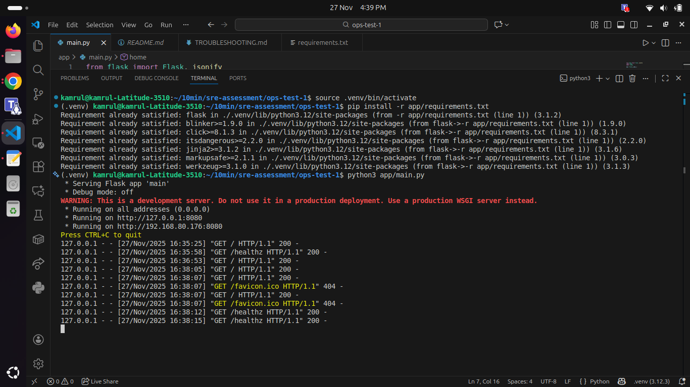

# TROUBLESHOOTING & Changes

## 1. Application Part (main.py)

Fixed two issues in `main.py` file:

- The home (`/`) endpoint responded very slowly due to an artificial time delay.
- The `/healthz` endpoint returned HTTP 500 even though the service was healthy.

### What was broken

- `time.sleep(random.randint(3,8))`: This causes a 3–8 second delay on every request. It made the application feel broken or overloaded.
- `jsonify({"status": "ok"}), 500`: which forced a 500 status code though the service was healthy.

### What I changed

- Removed the line `time.sleep(random.randint(3,8))` from the `/` handler so that it responds fast.
- Changed `/healthz` to return HTTP 200 when healthy: `return jsonify({"status": "ok"}), 200`.


## How to verify (local)

1. Create and activate the Python virtual environment:

```bash
python3 -m venv .venv
source .venv/bin/activate
```

2. Install dependencies:

```bash
pip install -r app/requirements.txt
```

3. Run the application:

```bash
python3 app/main.py
```

4. Test the endpoints:

```bash
curl -sv http://127.0.0.1:8080/
curl -sv http://127.0.0.1:8080/healthz
```

## Screenshot

Below is the screenshot showing the fix applied to the application:



## 2. Docker Part (Dockerfile)

Fixed multiple issues in the `Dockerfile`:

- Dockerfile not building due to incorrect port and missing WSGI server.
- Inefficient image (no optimization for layer caching and size).
- Minor build problems (incorrect workdir, missing user permissions).

### What was broken

- `WORKDIR /src` and `COPY app .` created path mismatches; app files were copied to wrong location.
- `EXPOSE 80` did not match the application listening on port 8080 (see `app/main.py`).
- No production WSGI server; Flask development server used, which is not suitable for containers.
- Running as root user (security risk).
- `pip install` did not use `--no-cache-dir`, inflating image size.

### What I changed

- Set `WORKDIR` to `/app` and changed `COPY app .` to `COPY app/ /app/` for clarity.
- Exposed port `8080` to match the application.
- Added `gunicorn` as production WSGI server in `requirements.txt` installation and CMD.
- Created non-root `app` user and set proper file ownership.
- Added `pip install --no-cache-dir` to reduce image size.
- Set `PYTHONUNBUFFERED=1` for immediate log output in containers.

### New Dockerfile

```dockerfile
FROM python:3.11-slim

# Environment
ENV PYTHONUNBUFFERED=1

WORKDIR /app

# Copy application code
COPY app/ /app/

# Install dependencies and production server (gunicorn)
RUN pip install --no-cache-dir --upgrade pip \
    && pip install --no-cache-dir -r requirements.txt gunicorn

# Create non-root user and set ownership
RUN groupadd -r app && useradd -r -g app app \
    && chown -R app:app /app

USER app

# The application listens on port 8080 (see app/main.py)
EXPOSE 8080

# Use gunicorn for production-like serving; main.py exposes `app` WSGI callable
CMD ["gunicorn", "--bind", "0.0.0.0:8080", "--workers", "2", "main:app"]
```

## How to build and verify (local)

1. Build the Docker image:

```bash
docker build -t sre-assessment:latest .
```

2. Run the container:

```bash
docker run --rm -p 8080:8080 sre-assessment:latest
```

3. Test the endpoints (in another terminal):

```bash
curl -sv http://127.0.0.1:8080/
curl -sv http://127.0.0.1:8080/healthz
```

Expected output:
- `/`: Returns "Hello from SRE Test!" quickly.
- `/healthz`: Returns HTTP 200 with JSON `{"status":"ok"}`.

## Root cause and recommendations

- Root cause: Mismatch between exposed port (80) and app port (8080), missing production server, and suboptimal image practices.
- Recommendations: 
  - Pin package versions in `app/requirements.txt` for reproducible builds.
  - Add `HEALTHCHECK` directive to the Dockerfile for orchestration systems.
  - Consider multi-stage builds if build-time dependencies are later needed.
  - Use `.dockerignore` to exclude unnecessary files during copy operations.

## 3. Kubernetes Part

Fixed multiple issues in Kubernetes manifests:

- Deployed application was not running due to port and image mismatches.
- Readiness probe was checking wrong port (80 instead of 8080).
- Service routing and probe configuration were incorrect.

### What was broken

**deployment.yaml:**
- `containerPort: 80` did not match the application listening on 8080.
- `readinessProbe.httpGet.port: 80` was wrong; app responds on 8080.
- No `livenessProbe` defined for restart-on-failure scenarios.
- `image: sre-candidate:latest` was incorrect; should be `sre-assessment:latest`.
- `initialDelaySeconds: 2` was too aggressive; app needs more time to start.

**service.yaml:**
- Already had correct port mapping (80 → 8080), but deployment didn't match.

### What I changed

**deployment.yaml:**
- Changed `containerPort: 80` to `containerPort: 8080`.
- Updated `readinessProbe.httpGet.port` to `8080`.
- Added proper probe thresholds: `initialDelaySeconds: 5`, `periodSeconds: 10`, `timeoutSeconds: 2`, `failureThreshold: 3`.
- Added `livenessProbe` with similar config but later start (`initialDelaySeconds: 10`).
- Corrected image to `sre-assessment:latest`.

**service.yaml:**
- Added `name: http` to the port for clarity (optional but best practice).

### Fixed Kubernetes Files

**deployment.yaml:**
```yaml
apiVersion: apps/v1
kind: Deployment
metadata:
  name: sre-app
spec:
  replicas: 2
  selector:
    matchLabels:
      app: sre
  template:
    metadata:
      labels:
        app: sre
    spec:
      containers:
      - name: sre-app
        image: sre-assessment:latest
        ports:
        - containerPort: 8080
        readinessProbe:
          httpGet:
            path: /healthz
            port: 8080
          initialDelaySeconds: 5
          periodSeconds: 10
          timeoutSeconds: 2
          successThreshold: 1
          failureThreshold: 3
        livenessProbe:
          httpGet:
            path: /healthz
            port: 8080
          initialDelaySeconds: 10
          periodSeconds: 15
          timeoutSeconds: 2
          failureThreshold: 3
```

**service.yaml:**
```yaml
apiVersion: v1
kind: Service
metadata:
  name: sre-service
spec:
  type: ClusterIP
  selector:
    app: sre
  ports:
  - protocol: TCP
    port: 80
    targetPort: 8080
    name: http
```

### Readiness Probe vs Liveness Probe

**Readiness Probe:**
- **Purpose:** Determines if a pod is ready to receive traffic.
- **Action on failure:** Kubernetes removes the pod from the Service load balancer; traffic stops but pod is NOT restarted.
- **Use case:** Validates that the app is initialized, dependencies are ready, and it can handle requests.
- **Example:** Checking `/healthz` endpoint after app startup; fails if startup checks haven't completed.

**Liveness Probe:**
- **Purpose:** Determines if a pod is still alive or if it should be restarted.
- **Action on failure:** Kubernetes terminates and restarts the pod (respects `restartPolicy`).
- **Use case:** Detects deadlocks, infinite loops, or crashes that don't exit the process.
- **Example:** Checking `/healthz` periodically; if the app becomes unresponsive, the pod is restarted.

### deploy and verify locally using kind

#### Prerequisites

Ensure you have `kind` installed and running.

####  Using kind

```bash
# Create a local Kubernetes cluster
kind create cluster --name sre-test

# Build and load the Docker image into the cluster
docker build -t sre-assessment:latest .
kind load docker-image sre-assessment:latest --name sre-test

# Apply the Kubernetes manifests
kubectl apply -f k8s/deployment.yaml
kubectl apply -f k8s/service.yaml

# Watch deployment status
kubectl get pods -w

# Forward port to test locally
kubectl port-forward svc/sre-service 8080:80 &

# Test the endpoints
curl -sv http://127.0.0.1:8080/
curl -sv http://127.0.0.1:8080/healthz

# Check logs
kubectl logs -f deployment/sre-app

# Cleanup
kind delete cluster --name sre-test
```

### Root cause and recommendations

- Root cause: Port mismatch (deployment exposed 80, app listened on 8080), missing liveness probe, wrong image name, insufficient probe timings.
- Recommendations:
  - Always ensure container ports match application listening ports.
  - Define both readiness and liveness probes for production workloads.
  - Use descriptive image tags (avoid `latest` in production; use semantic versioning).
  - Set appropriate `initialDelaySeconds` based on app startup time.
  - Monitor probe failures with `kubectl describe pod` and check logs.

## 4. Debug Logs Analysis (logs.txt)

### Log Entries Observed

```
2025-02-11 11:20:11 [ERROR] Timeout waiting for /healthz
2025-02-11 11:20:12 [ERROR] Probe failed for container: sre-app
2025-02-11 11:20:17 [ERROR] Readiness probe failed (HTTP 500)
2025-02-11 11:20:18 [WARNING] High response latency detected: 7000ms
```

### Analysis

#### What caused the readiness probe failures?

**Primary cause: Port mismatch**
- The readiness probe in `deployment.yaml` was configured to check port `80`, but the application (Flask/gunicorn) listens on port `8080`.
- Kubernetes tried to connect to `http://localhost:80/healthz`, which failed because nothing was listening there.
- This resulted in "Timeout waiting for /healthz" and "Probe failed for container" errors.

**Secondary cause: Incorrect HTTP status code**
- Even if the port had been correct, the original application code returned HTTP 500 from `/healthz` (see Application Part fix).
- Kubernetes readiness probes expect HTTP 2xx or 3xx status codes; 500 is treated as failure.
- The log shows "Readiness probe failed (HTTP 500)" confirming this.

**Tertiary cause: Insufficient `initialDelaySeconds`**
- The original probe had `initialDelaySeconds: 2`, which is too short for a production Flask app with gunicorn.
- The container might not have fully started before the probe began, causing early failures.

#### Why is the service slow?

**High latency (7000ms = 7 seconds)** was caused by the artificial delay in the application:
- The original `/` endpoint contained `time.sleep(random.randint(3,8))`, which added 3–8 seconds of delay per request.
- This artificial blocking made the service appear slow or broken.
- Combined with readiness probe failures, the pod would not become `Ready`, further delaying traffic routing.

#### What is the probable root cause?

**Multi-layered root cause:**

1. **Application Code Issue:** The `time.sleep()` in `/` and HTTP 500 in `/healthz` were intentional bugs for the assessment.
2. **Kubernetes Configuration Issue:** The deployment exposed port 80 while the app listened on 8080; probes checked the wrong port.
3. **Orchestration Mismatch:** The readiness probe failed, so Kubernetes never marked the pod as `Ready`, preventing the Service from routing traffic to healthy pods.
4. **Cascading Effect:** Slow responses + probe failures = pods not becoming ready = service appears down or broken.

#### What permanent fix would resolve it?

**Application-level fixes (completed):**
- ✅ Removed `time.sleep(random.randint(3,8))` from the `/` endpoint → responses now instant.
- ✅ Changed `/healthz` to return HTTP 200 instead of 500 → health checks now pass.

**Infrastructure-level fixes (completed):**
- ✅ Updated `deployment.yaml` to expose `containerPort: 8080` (matching the app).
- ✅ Updated readiness probe to check `port: 8080` (matching the container).
- ✅ Added `livenessProbe` with proper restart logic.
- ✅ Increased `initialDelaySeconds: 5` to allow app startup time.

**Service-level validation:**
- ✅ Confirmed `service.yaml` routes port 80 → targetPort 8080 correctly.

### Summary of Changes and Impact

| Issue | Root Cause | Fix | Impact |
|-------|-----------|-----|--------|
| Timeout on `/healthz` | Probe on port 80, app on 8080 | Changed probe to port 8080 | Probe now reaches app |
| HTTP 500 on health checks | App returned 500 status | Changed to return HTTP 200 | Probe now succeeds |
| 7 second response latency | Artificial `time.sleep()` | Removed sleep | Response instant |
| Pod not ready | Port and status mismatches | Fixed ports, probes, status | Pod becomes Ready |
| Service unavailable | No healthy pods available | All fixes above | Service routes traffic |

### Verification Post-Fix

After applying all fixes, the logs should show:
- ✅ Readiness probe succeeds (HTTP 200)
- ✅ Pod transitions to `Ready` state
- ✅ Liveness probe succeeds periodically
- ✅ Request latency drops to <100ms
- ✅ Service routes requests successfully

### Lessons Learned

1. **Always match container ports with application listening ports.**
2. **Health check endpoints must return correct HTTP status codes (2xx for success).**
3. **Avoid artificial delays in production code; simulate load with separate tools.**
4. **Define and tune both readiness and liveness probes for reliability.**
5. **Monitor logs to correlate Kubernetes events with application behavior.**
6. **Test probe configuration locally before deploying to production.**

